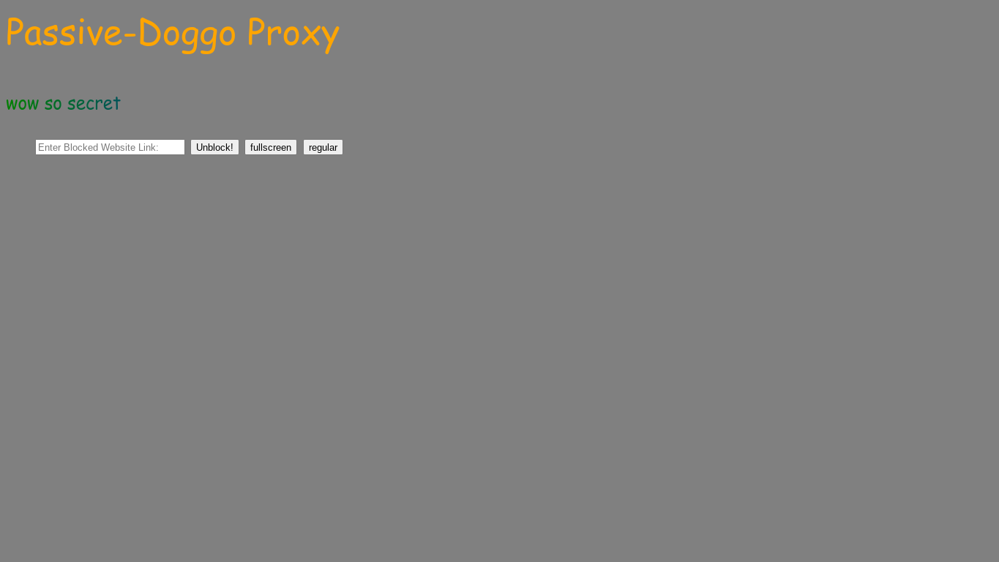
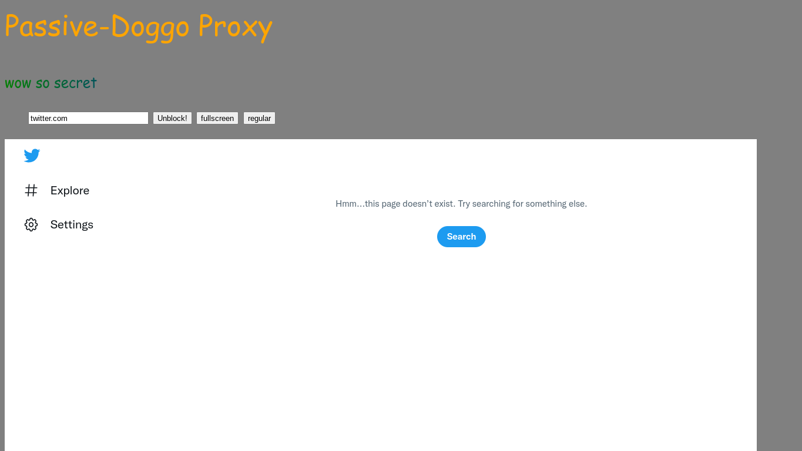
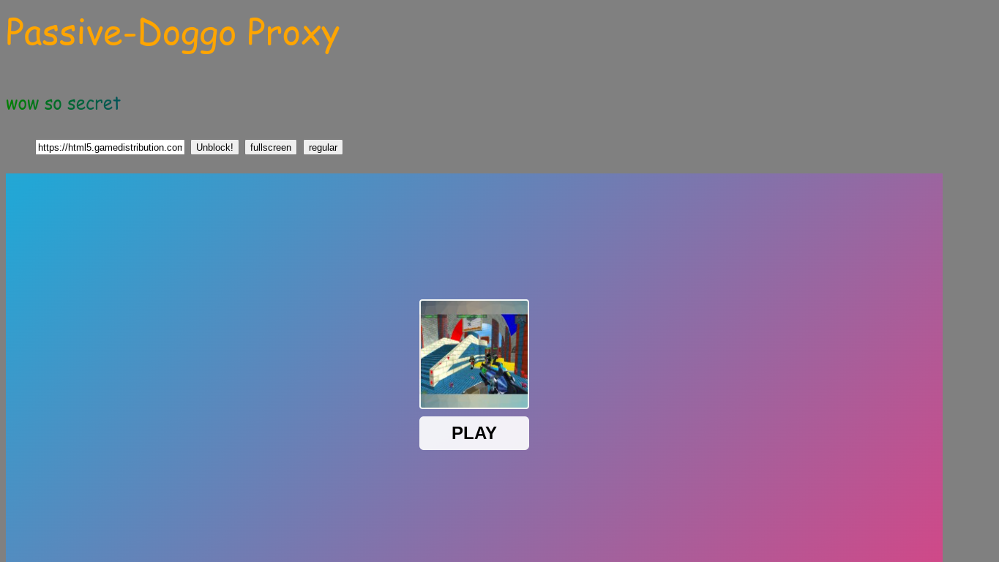

# Passive Doggo
<p align="center" width="100%">
    
</p>

## Passive Doggo is a "passive proxy" that unblocks any site, including extension and DNS blocked sites.
### an example of the index homepage running on a school managed chromebook:


## Table Of Contents:
1. How To Set Up 
     - Modules
2. Documentation
     - How it works
     - Limitation
     - School / Work Use
     - License
     - Screenshots

## How To Set-Up

First, Download this Repo as a Zip or Clone It `git clone https://github.com/BeyYT/Passive-Doggo.git`

Afterwards, CD into it:
- Linux/Mac: `cd Passive-Doggo`
- Windows: `cd .\Passive-Doggo`

Install Modules:
```
npm i -g forever http-server concurrently
npm i express website-scraper
```

Finally Start The Server.

`npm start`

You Should See The Following Output:

```
> passive-doggo-proxy@x.x.x start
> concurrently "forever server.js start" "http-server -p 8030 -d false -i false"

[1] Starting up http-server, serving ./
[1]
[1] http-server version: 14.0.0
[1]
[1] http-server settings:
[1] CORS: disabled
[1] Cache: 3600 seconds
[1] Connection Timeout: 120 seconds
[1] Directory Listings: not visible
[1] AutoIndex: not visible
[1] Serve GZIP Files: false
[1] Serve Brotli Files: false
[1] Default File Extension: none
[1]
[1] Available on:
[1]   http://10.0.0.104:8030
[1]   http://127.0.0.1:8030
[1] Hit CTRL-C to stop the server
```

Now You Can Visit `localhost:8030/index` and start using the proxy!

## Documentation:

### How it Works:

Every time You Send a Request To The Server, It Uses the `website-scraper` module and scrapes the website directory into a temporary folder (hence, the `temp` folder)

Afterwards, it sends a link to the index.html to that `temp-hosted` website.

### Limitations:

This Proxy Has its Limitations, Such as:
- Discord, Reddit, And websites that detect scrapers do not work.
- href Redirects do not work (working on a fix!)

### School / Work Use:
I Strongly Do Not Condone The Use of this proxy for malicious or nefarious uses.
- XXX Sites
- Website Booters
- illegal use
- Hacking
- Viruses

I will go out of my way to prevent this if anyone does this.

### License:
Using the MIT License, See [LICENSE](https://github.com/BeyYT/Passive-Doggo/blob/main/LICENSE) for more info.

### Screenshots:
(taken on a school managed chromebook)


